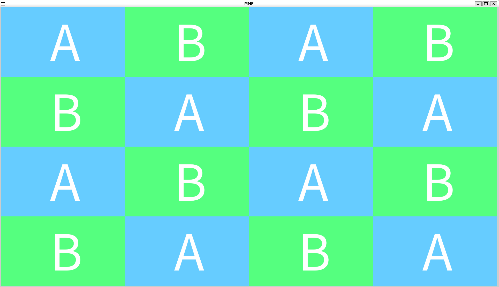

# README

简体中文

## 简介

`mmp_sample` 提供 [MMP-Core](https://github.com/HR1025/MMP-Core) 一些接口的使用方法, 示例以单独 *main.cpp* 展示.

也就是说, 不用特意去关注 `include` 和 `source` 下的代码, 都是一些简单的辅助接口.

更进一步, 只需要关心 `xxx.cpp` 中的 `int App::main(const ArgVec& args)` 实现.

示例都集中在项目的根目录, 以 `xxx.cpp` 命名; `.cpp` 的名称即为对应用例可执行程序名称.

## 编译

### Linux (Debian System)

```shell
sudo apt install libgbm-dev libsdl2-dev libgl1-mesa-dev* nasm libx11-dev libdrm-dev libva-dev
rm -rf build
mkdir build
git submodule update --init --recursive
cd build && cmake .. -DUSE_OPENGL=ON -DUSE_GBM=ON -DUSE_SDL=ON -DUSE_SPRIV_CROSS=ON -DUSE_VULKAN=ON -DUSE_X11=ON -DUSE_VAAPI=ON -DUSE_OPENH264=ON && make -j4
```

## 如何调试

选择一个能与 `CMake` 结合的 `IDE` 工具即可, `demo` 附带了 `vscode` 使用的 `launch.json`.

## 用例

>
> 详细的配置可以通过 `-h` 进行查看.
>  

### test_gl_compositor

`test_gl_compositor` 展示了如何实现多画面合成的效果, `MMP-Core` 定义了三个术语 `Item` 、`Layer` 及 `Compositor`;

多个 `Item` 可以被添加入同一个 `Layer`, 需要保证其互不相交;

多个 `Layer` 可以被添加入同一个 `Compositor`, 从而实现画面合成的功能.

`test_gl_compositor` 支持一些配置项, 如下:

- backend : 处理节点, 可能可选 OPENGL, OPENGL_ES, D3D11 和 VULKAN
- split_num : 分屏数量, 如默认为 4, 会显示四分屏的效果
- frame_per_second : 刷新帧率, 默认 60 帧
- merry_go_around : 跑马灯效果, 按照每秒 2 帧的速度移动画面
- duration : 持续时间, 单位为 s

效果图:



## 其他

在不同的平台上, 或者不同的驱动上, 相同的测试用例可能出现不同的效果, 或者更严重点甚至无法运行或者崩溃.

这是由于跨平台和驱动所相关的兼容性问题, 难以在开发阶段发现并处理, 或者就是 `MMP-Core` 程序本身的逻辑错误.

一般来说简易的兼容性问题经过自己简单的定位以及修改, 基本上还是可以让程序运行起来的.
