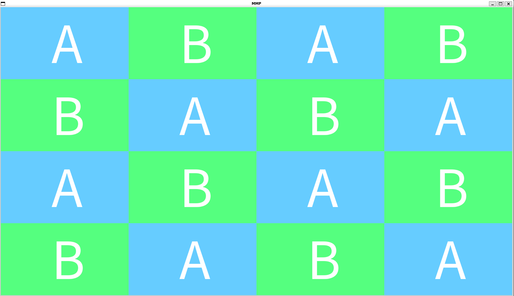
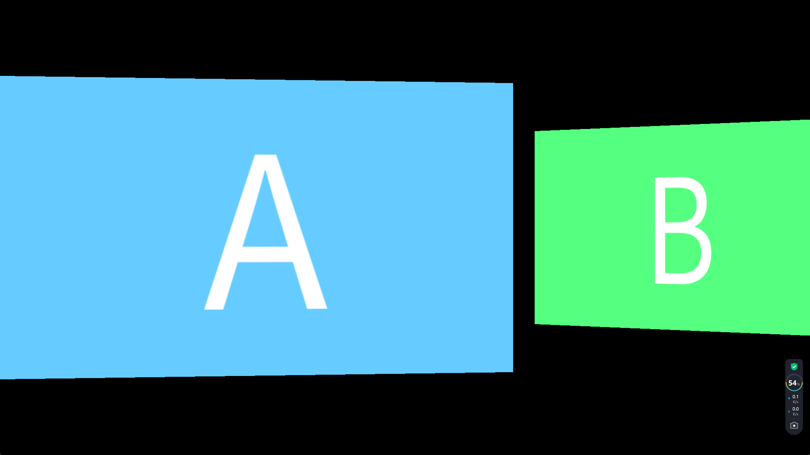
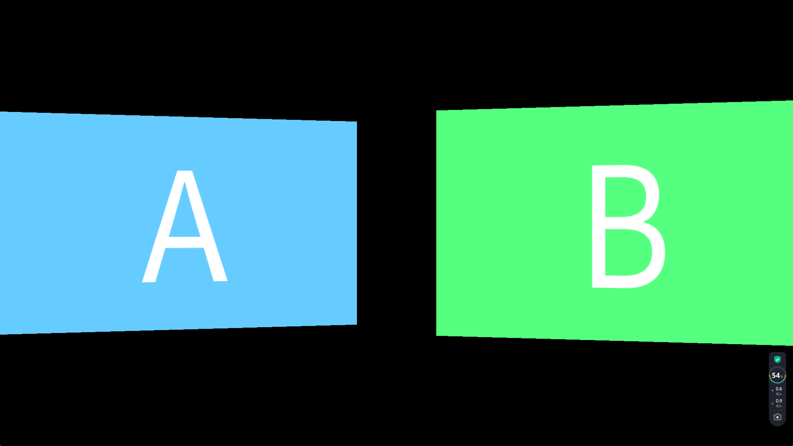
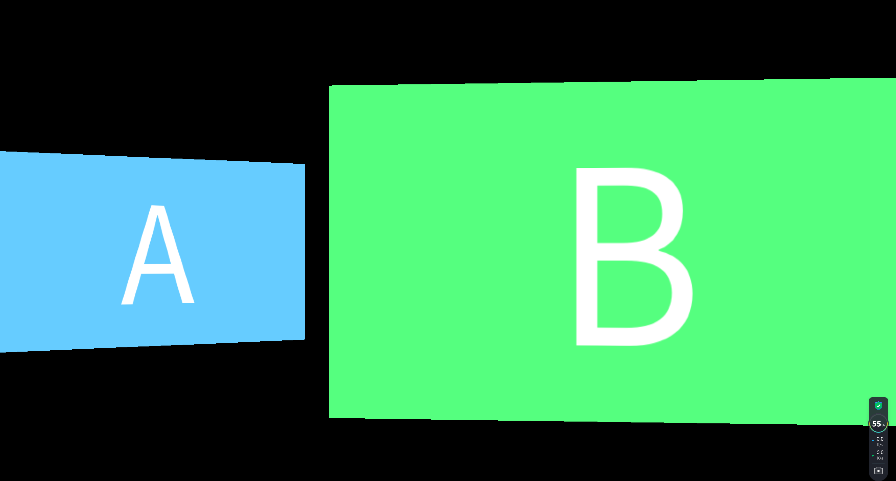

# README

English | [简体中文](./README.md)

## Introduction

`mmp_sample` provides usage examples for some interfaces of [MMP-Core](https://github.com/HR1025/MMP-Core), demonstrated in a standalone *main.cpp*.

In other words, you don't need to pay special attention to the code under `include` and `source`, as they are just simple auxiliary interfaces.

Furthermore, you only need to focus on the implementation of `int App::main(const ArgVec& args)` in `xxx.cpp`.

All examples are concentrated in the root directory of the project, named as `xxx.cpp`; the name of the `.cpp` file corresponds to the executable program name for each example.

## Compilation

### Linux (Debian System)

```shell
sudo apt install libgbm-dev libgl1-mesa-dev* nasm libx11-dev libdrm-dev libva-dev
rm -rf build
mkdir build
git submodule update --init --recursive
cd build && cmake .. -DUSE_OPENGL=ON -DUSE_GBM=ON -DUSE_SDL=ON -DUSE_SPRIV_CROSS=ON -DUSE_VULKAN=ON -DUSE_X11=ON -DUSE_VAAPI=ON -DUSE_OPENH264=ON && make -j4
```

## Windows (MSVC 2022 x64)

```shell
git submodule update --init --recursive
mkdir build
cmake --no-warn-unused-cli -DCMAKE_EXPORT_COMPILE_COMMANDS:BOOL=TRUE -S. -B./build -G "Visual Studio 17 2022" -T host=x86 -A win32
cmake --build build --config Release -j 16
```

## Windows (MSVC 2022 x86)

```shell
git submodule update --init --recursive
mkdir build
cmake --no-warn-unused-cli -DCMAKE_EXPORT_COMPILE_COMMANDS:BOOL=TRUE -S. -B./build -G "Visual Studio 17 2022" -T host=x64 -A x64
cmake --build build --config Release -j 16
```

>
> You can also use an `IDE` directly for building on `Windows`, just select the corresponding toolchain during the build process.
>

## How to Debug

Choose an `IDE` tool that integrates with `CMake`. The demo includes a `launch.json` for use with `vscode`.

## Examples

>
> Detailed configurations can be viewed using `-h`. (Use `\h` on `Windows`)
>

### test_gl_compositor

The example `test_gl_compositor` demonstrates how to achieve multi-screen composition effects. In MMP-Core, three terms are defined: `Item`, `Layer`, and `Compositor`.

Multiple items can be added to a single layer, ensuring they do not overlap.

Multiple layers can be added to a single compositor, thus achieving screen composition functionality.

The example supports several configuration options:

- backend: Processing node, options include OPENGL, OPENGL_ES, D3D11, and VULKAN.
- split_num: Number of splits; defaults to 4 for a four-way split effect.
- frame_per_second: Refresh rate; defaults to 60 frames per second.
- merry_go_around: Marquee effect; moves the screen at a speed of two frames per second.
- duration: Duration in seconds.

Example image:



### test_gl_transition

The example `test_gl_transition` demonstrates how to achieve transition effects typically seen during screen changes.

MMP-Core's transitions are ported from [gl-transitions](https://github.com/gl-transitions/gl-transitions) with modifications to support both GLSL and HLSL.

The example supports several configuration options:

- backend: Processing node; options include OPENGL, OPENGL_ES, D3D11, and VULKAN.
- transition: Transition type; see details with `-h`.
- duration: Duration in seconds.

Below is an illustration of the SwapTransition at different stages (`progress` at 0.25, 0.5, and 0.75):







## Others

On different platforms or drivers, identical test cases may yield different results or even fail or crash due to cross-platform compatibility issues that are hard to detect and address during development or due to logical errors within MMP-Core itself.

Generally speaking, simple compatibility issues can often be resolved through basic troubleshooting and modifications.